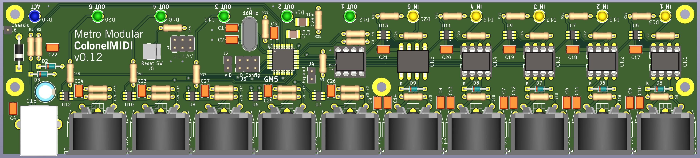

# ColonelMIDI 5x5 Port USB-MIDI Interface

This is an updated take on the [nILS GM5x5x5](http://www.midibox.org/dokuwiki/gm5x5x5>) multiport implementation of the [Ploytec GM5](https://www.usb-audio.com/gm5/) reference board, based around an Atmel AT90USB processor with preloaded custom firmware. Although it uses the published mechanical dimensions of the GM5x5x5, it is effectively a new circuit design that improves on both the Ploytec reference design and the GM5x5x5, with care taken to return to datasheets to ensure that part values are compatible with specifications.

<b>v0.1 (initial):</b> Main changes over gm5x5x5 and reference board are: 

-grouping MIDI ports by IN or OUT orientation rather than pairing by port number, as controllers and sound modules are more likely to be separate nowadays;

-reversing order of MIDI ports so they are in ascending order from left to right when LED side is to front;

-done in Kicad v9 rather than EAGLE!;

-reverse voltage protection Schottky diode across power lines;

-3.6V zener diodes to protect USB data lines against over/reverse voltage transients; 

-modern SOT236 high-current CMOS schmitt triggers for LED driving and signal buffering (good soldering practice/warmup for the GM5 chip...); 

-all LEDs located directly in front of the ports they indicate; 

-updated the MIDI jack connections in line with the 2014 CA-033 revision of the MIDI 1.0 standard, by grounding the shell connections on output jacks, and connecting the shell and ground at the input jack to ground via 100n capacitors that remove RFI but block audio ground loop hum;

-connecting the shell of the USB jack to ground via 100n capacitor that removes RFI but blocks audio ground loop hum;

-6-pin AVRISP port added for those who might want to program their own firmware from scratch on a blank chip;

-input optoisolation circuitry based around internally buffered 6N137s rather than Dodgy Darlington 6N138s;

-GM5x5x5 options for external power, pin header duplication of MIDI jacks, and guidance for configuring the number of ports are not included, as this is intended as a standalone "full-function" device rather than an embedded submodule;

-removing the header for in-situ EEPROM flashing, as anyone advanced enough to do this (especially with the [MIDIBOX Utility](https://github.com/midibox/mios8/tree/98251ece080990915ee04ef88805124c7413f9d5/mbhp/mbhp_usb_gm5_eeprom)) can rig up a square inch of perfboard with an IC socket, a header, and 2 resistors;

-adding a limit resistor and connector for an external reset switch;

-adding a location marker to keep JLCPCB production batch numbers hidden out of sight;

-neater board layout with ground planes both sides;

<b>v0.11:</b> 

-fix incorrect port labelling on LED side of board

<b>v0.12 (first source publication):</b> 

-use "spare" gates in input-side LED drivers for "belt and braces" buffering of 6N137 optocoupler outputs;

-add 10u SMT cap on Vcc line near MCU;

-cc-by-sa licensing
