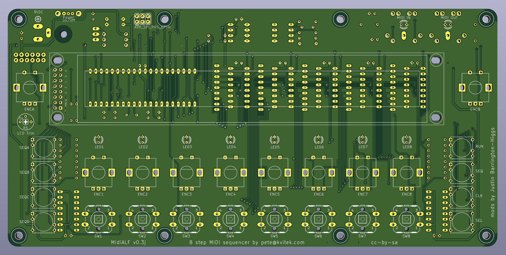

# MidiAlf

This is forked from the MidiAlf v0.2 files originally published at https://midisizer.com/midialf/

The original used Mutable Intruments hardware design elements to create a neat desktop MIDI pattern sequencer with storage memory, that could be expanded with CV outputs. In line with the original, it is released under a Creative Commons cc-by-sa license.

<b>v0.3j (initial release):</b> Changes from the original include:

-added the "missing" 220R resistor on the UART side of the MIDI out jack. (this was also missing in the Shruthi-1 motherboard design, and is needed to balance the MIDI signal for noise reduction);

-updated the MIDI jack connections in line with the 2014 CA-033 revision of the MIDI 1.0 standard, by grounding the shell connection on the output jack, and connecting the shell and ground at the input jack to ground via 100n capacitors that remove RFI but block audio ground loop hum;

-ported to KiCad 9 from the deprecated EAGLE format;

-retention peg holes added to allow use of Omron/Alps keyswitches as well as the standard E-Switch TL1100;

-encoder footprint with slotted retention tab pads to accommodate the Bourns PEC11R series;

-ground plane pour on both sides of the board.
